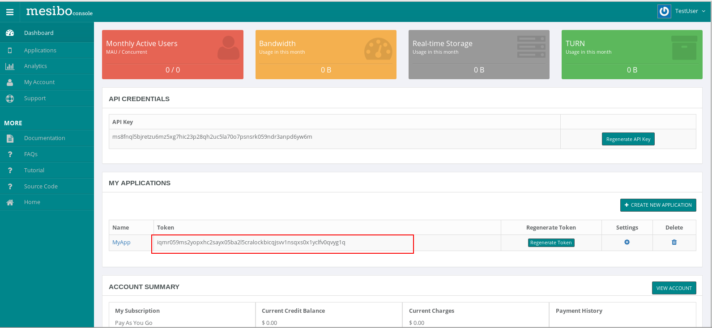
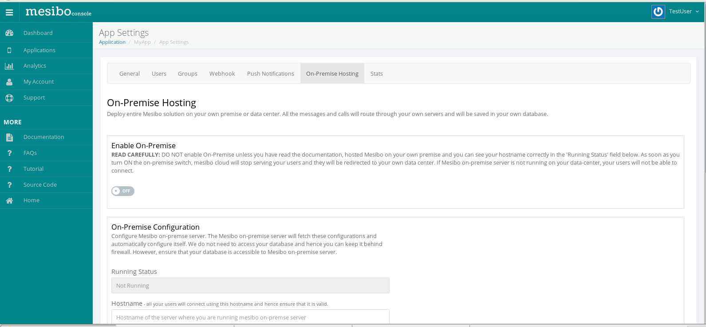
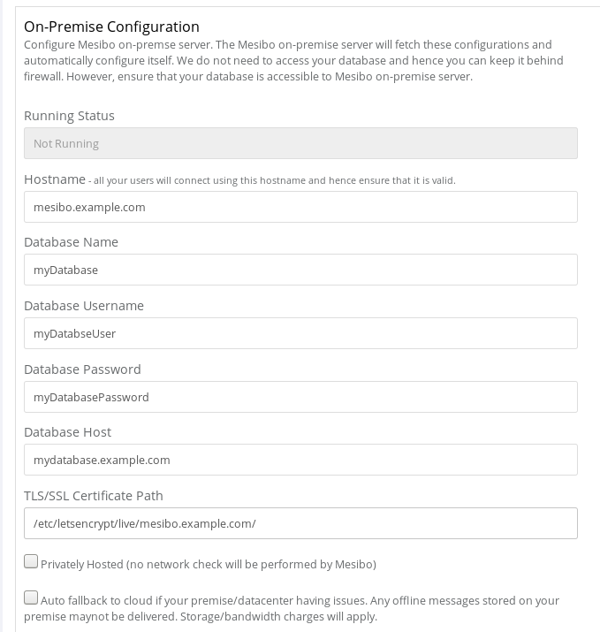
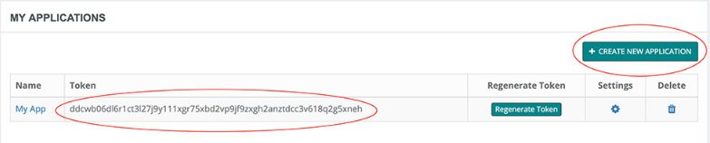
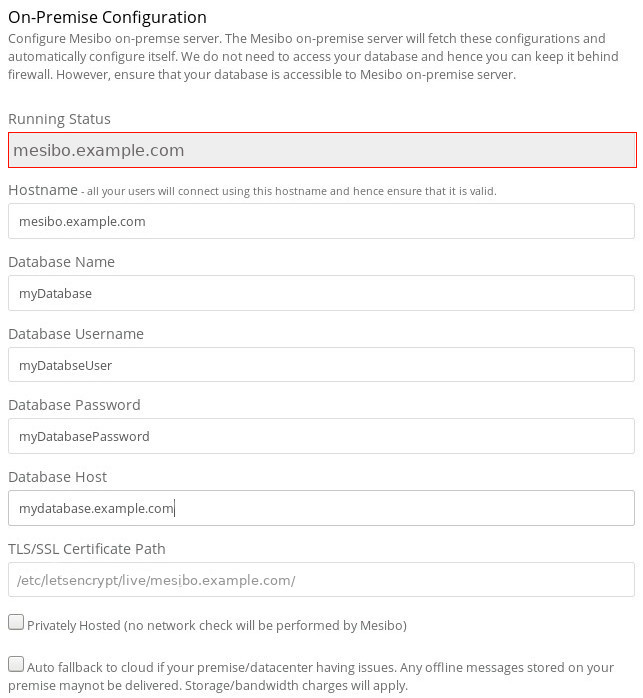

Mesibo On-Premise solution allows you to run the entire Mesibo solution in your own premise / data center. All the messages and calls goes through your own data center and stay in your own database. All you have to do is download Mesibo On-Premise server image and run it in your own data center. That's it! 

While our Cloud Service lets you start immediately without installing anything, the On-Premise model offers ultimate flexibility and control over your data, loadable modules, interface with machine learning and AI tools and much more. The pricing remains the same.However,the On-Premise model can work out to be more cost effective as there are no charges other than per active user charges. On the other hand, you pay for bandwidth and storage charges in our cloud offering.

If you do not wish to host Mesibo on your own server infrastructure you have the option of using the Cloud offering by Mesibo.

### Features
- All the mesibo features, including Messaging, Voice and Video calling
- Complete control over your data. All the messages and calls route through and stays in your own infrastructure. 
- Unlimited storage and data retention
- Unlimited Messages
- Private and public deployment
- Auto fallback to cloud as a backup, if required. 
- Push notifications
- Loadable modules and scripting
- At no additional cost


### Prerequisites
It is required that you are familar with:

- Mesibo API and successfuly using Mesibo cloud services. If not, please refer to  
[getting started](https://mesibo.com/documentation/get-started/) guide and tutorials before setting up On-Premise server.

- Setting up a Linux server and MySQL database. If not, refer to online tutorials for the Linux distribution of your choice. 

- Although not essential, basic knowledge of setting up Docker and using Docker images would be helpful.You can refer to [Docker documentation](https://docs.docker.com) and various online tutorials on docker. 


### Requirements
Mesibo is extremely simple to setup with On-Premise Messaging, Voice and Video call server. You only need to provide bare minimum infomation regarding your setup and network ,the rest will be taken care by Mesibo. 

Mesibo only requires the following:

- Linux 64-bit server (or an instance) with at least 1GB free RAM. Mesibo supports all the major Linux distributions, including: 

	- RHEL or CentOS 7.x 

	- Ubuntu 16.x or 18.x

	- Fedora 28 or 29

	- Debian 9 or 10

	- SLES 15

	- Oracles Linux 7.x## On-Premise vs Cloud offering

- MySQL (or MariaDB) database 

## Should I recompile my application to work with Mesibo On-Premise?
Definitely not. If you already have your applications connected to Mesibo Cloud Service and are successfully using Mesibo API services,you just need to configure your host server and tell Mesibo to redirect your connection to your own server.   

Whether you use Mesibo Cloud Service or setup a dedicated server running Mesibo,there is absolutely no change in the way you use Mesibo APIs or deploy your application. With Mesibo On-Premise you have the added advantage of having control over your data storage and privacy.

If in any case your On-Premise server has issues, you always have the option of falling back to Mesibo Cloud Services.


## Setting up Mesibo-On Premise
Setting up Mesibo on your own premise is extremely simple .You only need to provide basic infomation regarding your database and network in the configuration settings from Mesibo console and run Mesibo Server Image by supplying your application token.

Follow the steps below to setup Mesibo On-Premise :

## Step 1 - Install Docker
Mesibo On-Premise server is distributed as a docker image so that you can install it on most Linux distributions without worrying about any dependencies etc. All you need is to install Docker to run it. If you have already installed and running Docker on your server, you can skip to Step 2. 

You can install Docker by running the command below.

```
$ sudo curl -sSL https://get.docker.com/ | sh
```

Once Docker is installed, you need to start the Docker daemon. Most Linux distributions use `systemctl` to start services. If you
do not have `systemctl`, use the `service` command.

- **`systemctl`**:

  ```bash
  $ sudo systemctl start docker
  ```

- **`service`**:

  ```bash
  $ sudo service docker start
  ```

Once the installation is over, you can verify it by running 

```
$ sudo docker run hello-world
```
```
Hello from Docker!
This message shows that your installation appears to be working correctly.

```

## Step 2 - Download Mesibo On-Premise Server Image
Download Mesibo On-Premise docker image by running the following command

```
$ sudo docker pull mesibo/mesibo
```
However, before we launch Mesibo, we need to setup mesibo configuration in the console.

## Step 3 - Configure Mesibo

The complete configuration of your Mesibo On-Premise hosting can be done through [Mesibo Console](https://mesibo.com/console/). All the configuration settings for your server will be automatically handled by Mesibo.There is no need to supply any extra configuration file on your server.   

1. From console,choose the application you want to connect with your On-Premise host from the 'MY APPLICATIONS' section in the console and make note of the app token. You need to supply this app token to run Mesibo Server Image in Step-4.


2. Go to App Settings →  On-Premise Hosting


3. In On-Premise settings page you will find two sections: Enable On-Premise and On-Premise Settings. 

>Warning: Before configuring mesibo ,DO NOT turn on the Enable On-Premise switch.

4. Enter all the required configuration details for your On-Premise host in the settings section


Mesibo requires the following configuration details:

- Your Hostname. All your users will connect to this hostname and hence ensure that it is correct.

- Database Information : Database Name,Database Username,Database host ,Database Password

- TLS/SSL Cerificate for your hostname [Optional but recommended]



There is a configuration setting available to redirect mesibo in case your premise/datacenter is having issues. If you enable - Auto fallback to cloud,  Mesibo will connect your application to Mesibo Cloud Services immediately. However,any offline messages stored on your premise maynot be delivered. Storage/bandwidth charges will apply.

Also,if you enable Privately Hosted ,no network check will be performed by Mesibo.

### Configuring TLS Certificate

SSL/TLS encryption of your host leads to better security for your users.To configure TLS/SSL certificate you need to provide the folder path to the following files :
```
cert.pem 
chain.pem 
privkey.pem
```
For example,

Although Mesibo can automatically generate a self-signed certificate for you, it is recommended that you configure a valid certificate. Self-signed certificate is not considered valid by many browsers and you may not be able to run Web API based applications.

You can use any existing ceriticate, OR [Letsencrypt](https://letsencrypt.org/) which is a free service OR any other provides of your choice to get a secure ceritificate. In this case you can just provide the path to your certificate.
For example,
```
/etc/letsencrypt/live/example.com/cert.pem 
```

Note that, wild card certificate is not recommended. 

## Step 4 - Run Mesibo

Prior to running Mesibo docker container,ensure that you have completed all the necessary configuration in the console as specified in Step-3. Note ,that the Running Status field displays "Not Running"


Run Mesibo :

```bash
$ sudo docker run -p 5222:5222 -p 5228:5228 -p 80:80 -p 443:443 -p 4443:4443 -p 5443:5443 -p 513:513 \
        -d mesibo/mesibo  <APP_TOKEN>
```

You need to specify the APP_TOKEN which needs to be run on-premise,to the mesibo instance.
The token  for your application can be obtained from mesibo console as specified in Step-3.



For example,
```bash
$ sudo docker run -p 5222:5222 -p 5228:5228 -p 80:80 -p 443:443 -p 4443:4443 -p 5443:5443 -p 513:513 \
        -d mesibo/mesibo  iqmr059ms2yopxhc2sayx05ba2l5cralockbicqjsvv1nsqxs0x1yclfv0qvyg1q 
```

On sucessfull start of Mesibo ,the output log should look like below:

```
E3108-082633-388 (1): Unable to open /proc/sys/kernel/core_pattern (truncate 1)
E3108-082633-480 (1): Mesibo Build: Aug 29 2019 15:39:08
E3108-082633-506 (1): PID: 1
E3108-082633-775 (1): Local IP Address: 172.17.0.2
E3108-082634-580 (10): *** onp_message: On-Premise not enabled - login to Mesibo console to enable it
E3108-082634-639 (10): Generating TLS certificate for 192.168.0.107
I3108-082635-167: Starting mesibo

```

You can view logs using
```bash
$ sudo docker logs <CONTAINER_ID>
```

To the CONTAINER_ID of the docker container you are running use
	
```bash
$ sudo docker ps
```
```
CONTAINER ID        IMAGE               COMMAND                  CREATED             STATUS              PORTS                                                                                                                                                            NAMES
4fd84018a651        mesibo/mesibo       "/usr/bin/mesibo_onp…"   56 minutes ago      Up 56 minutes       0.0.0.0:80->80/tcp, 0.0.0.0:443->443/tcp, 0.0.0.0:513->513/tcp, 0.0.0.0:4443->4443/tcp, 0.0.0.0:5222->5222/tcp, 0.0.0.0:5228->5228/tcp, 0.0.0.0:5443->5443/tcp   modest_mendeleev

```
If your logs contain any errors indicating failure to start Mesibo refer to [troubleshooting](https://mesibo.com)

Now, check Running status of your server from Mesibo  console → App Settings → On Premise Hosting. If successfull the running status field will contain your hostname , otherwise it will contain "Not running"





If your on-premise server is setup properly continue with the next step , else refer to [troubleshooting](mesibo.com)


## Step 5 - Enable On-Premise
> Warning :
>DO NOT enable On-Premise unless you have read the documentation, hosted Mesibo on your own premise and you can see your hostname correctly in the 'Running Status' field below. As soon as you turn ON the on-premise switch, mesibo cloud will stop serving your users and they will be redirected to your own data center. If Mesibo on-premise server is not running on your data-center, your users will not be able to connect.


>Before Enabling the On-Premise switch ensure that your on-premise server is running and verify that in your On-Premise hosting console the Running Status field contains your hostname.


Turn on the on-premise switch and your app will be connected to your data center immediately. If a user logs into your application connected to Mesibo On-Premise your server logs should output

```
: login successful: root (uid xxxx) aid: (xxxx) 

```
That's it ! You are now up with mesibo running on your own server.


## Firewall Settings
Mesibo supports firewall configuration on your premise .It is recommended to use iptables ,which is the default tool provided in Linux to establish a firewall. If you have configured your network firewall or you prefer to keep your database protected behind a firewall ,you can do it independently.There are no additional changes to be made in the configuration of Mesibo On-Premise .


## Deploying with a cloud service provider
All major cloud service providers support running docker containers. To create an on demand instance of Mesibo in the cloud, refer to respective documentation on running docker containers :
- [AWS](https://aws.amazon.com/getting-started/tutorials/deploy-docker-containers/) 
- [Azure](https://azure.microsoft.com/en-us/services/container-instances/) 
- [Google Cloud](https://cloud.google.com/run/docs/deploying)

## Group Management


## Loading modules and scripts

You can load modules such as the [Mesibo C/C++ shared library](https://github.com/mesibo/libmesibo) to run on your own premise. 

```bash
$ curl -fsSL https://raw.githubusercontent.com/mesibo/libmesibo/master/install.sh 
$ chmod a+x install.sh
$ sudo ./install.sh

```
You can also run your scripts in bash,Python,JavaScript,MATLAB,etc to interface your application with machine learning ,analytics and scientific computing modules.


## Troubleshooting & FAQ

For a more detailed FAQ section on On Premise [refer](https://mesibo.com/documentation/faq/)

## I am currently using Mesibo Cloud services. If I enable on-premise how long will it take to switch connection to my server?
As soon you enable on-premise in the console, your application will get connected to your server. Please ensure that you have made the necessary configuration in the console and the running status displays your hostname before you enable On-Premise.

## Can I switch connection from Mesibo On-Premise back to Mesibo Cloud Service ? 
Yes, if you would like to completely stop connecting to your on-premise server ,stop your docker container which is running mesibo and disable On-Premise in the console .Your application will now get connected to Mesibo Cloud. 

## I have enabled On-Premise and my server is running, how do I know if my app is connected to my server?

You can check the logs for your server using 
```bash
sudo docker logs CONTAINER ID 
```
When a user on your app logs in , you'll get a login entry for that user. For further [troubleshooting](mesibo.com) you can use the mesibo C/C++ shared library.

## What happens if I have enabled on premise and my server is not running?
Please make sure in your console that the Running status for your server is up before enabling on premise. If your server is not running and you have enabled on premise your app will not be able to connect with mesibo and your users will fail to get your service.

## What happens if my server disconnects due to a network issue while hosting on premise? 
In the case of an issue with your on premise connection, mesibo will try to reconnect to your server for a few times. If that fails and you have [fall back to cloud] option enabled, your application will be connected to mesibo cloud. Otherwise mesibo will continue to reconnect to your server. Please check your server logs for further troubleshooting.


## What happens if I am connected to my server and disable On-Premise from console?
Mesibo will try to reconnect to your server and after a few retries it will connect to Mesibo Cloud service.If and only if you have enabled fall back to cloud in your configuration settings,Mesibo will switch to cloud .Please note storage charges for Mesibo Cloud Services will then apply and offline messages stored on your server may not be sent. 

However,it will redirect connection to your server as soon as you enable on-premise back again.

If you would like to completely switch back to Mesibo Cloud Services and do not want to connect to your server anymore -- stop your docker container running Mesibo and turn off On-Premise switch in the console. Now,your application will get connected to Mesibo Cloud.

## How can I upadate my Mesibo On-Premise docker image?
Always ensure that you have the latest version of Mesibo Docker Image running. To update your image run
```bash
sudo docker pull mesibo/mesibo
```

## How can I stop the docker container running Mesibo?
Get the CONTAINER_ID of the docker container you are running using
```
sudo docker ps
```
Now,to stop this container use
```
sudo docker stop <CONTAINER_ID>
```


## Can I run Mesibo on a cloud service provider?
All major cloud service providers support running docker containers.Please refer to respective documentation for different providers such as [AWS](https://aws.amazon.com/getting-started/tutorials/deploy-docker-containers/), [ Azure](https://azure.microsoft.com/en-us/services/container-instances/), [Google Cloud](https://cloud.google.com/run/docs/deploying),etc . For running Mesibo Docker Container follow the steps [here](https://mesibo.com)


## I am confused between On-Premise vs Cloud offering, Which one is better?
You can't go wrong with either model. While our Cloud service let you start immediately without installing anything, the on-premise model offers ultimate flexibility, control of your data, loadable modules, interface with machine learning and AI tools and much more. The pricing is same, however on-premise model can work out more cost effective as there are no charges other than per active user charges. On other hand, you pay for bandwidth and storage charges in our cloud offering.
Yes, definitely you have another option. If you do not wish to host mesibo on your own server you are free to use the cloud offering by Mesibo.

## Getting Error: MySQL Connection Failed -- Can't connect to MySQL server in server logs 
1.Check your databse host address ,hostname and other details is matching to the details you have entered in console. 
2.  Please check you have granted the necessary permissions to access your database from your hostname address.
3. Check your firewall configuration and ensure that is configured properly for allowing connections from your hostname address. (You can use the tool iptables to check your firewall configuration)
4. Stop your docker container and then start it.

## Getting Error: Unable to verify app token - network error in server logs
Check your firewall configuration and verify it is configured to allow connections from your host server.Then,stop your docker container and then start it.


