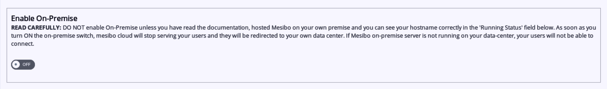
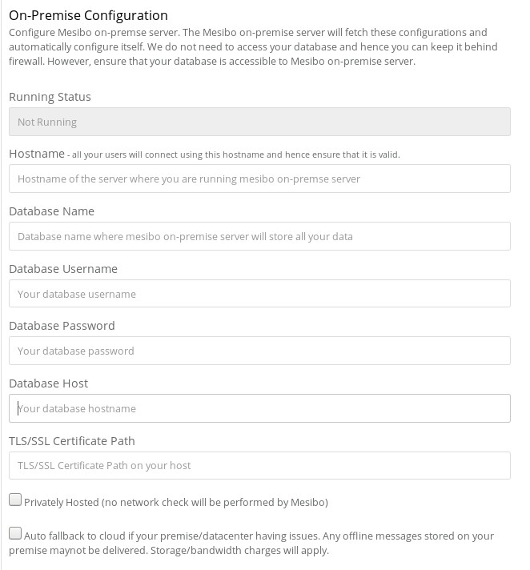
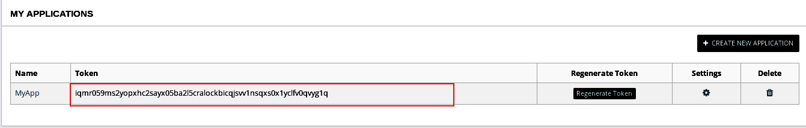

Mesibo On-Premise solution allows you to run the entire Mesibo solution in your own premise / data center. All the messages and calls goes through your own data center and stay in your own database. All you have to do is  download Mesibo on-premise server image and run it in your own data center. That's it! 

Mesibo On-Premise is the perfect solution for ultimate control over your sensitive data.We have also released the entire source code of Mesibo Android and iOS [sample apps](https://github.com/mesibo/samples) on GitHub, which is continuously updated. You can download the entire source code, and customize it to suit your needs. 

### Features
- All the mesibo features, including Messaging, Voice and Video calling
- Complete control over your data. All the messages and calls route through and stays in your own infrastructure. 
- Unlimited storage and data retention
- Unlimited Messages
- Private and public deployment
- Auto fallback to cloud as a backup, if required. 
- Push notifications
- At no additional cost

## On-Premise vs Cloud offering
You can't go wrong with either model. While our Cloud service let you start immediately without installing anything, the on-premise model offers ultimate flexibility, control of your data, loadable modules, interface with machine learning and AI tools and much more. The pricing is same, however on-premise model can work out more cost effective as there are no charges other than per active user charges. On other hand, you pay for bandwidth and storage charges in our cloud offering.

If you do not wish to host mesibo on your own server/infratructure you are free to use the cloud offering by Mesibo.


### Prerequisites
It is required that you are familar with:

- mesibo API and successfuly using Mesibo cloud services. If not, please refer to Mesibo 
[getting started](https://mesibo.com/documentation/get-started/) guide and tutorials before setting up On-Premise server.

- setting up a Linux server and MySQL database. If not, refer to online tutorials for the Linux distribution of your choice. 

- setting up Docker and using Docker images. If not, refer to [Docker documentation](https://docs.docker.com) and various online tutorials on docker. 


### Requirements
Mesibo is extremely simple to setup with On-Premise Messaging, Voice and Video call server. You only need to provide bare minimum infomation regarding your setup and network and rest will be taken care by Mesibo. 

Mesibo only requires the following:

- Linux 64-bit server (or an instance) with at least 1GB free RAM. Mesibo supports all the major Linux distributions, including: 

	- RHEL or CentOS 7.x 

	- Ubuntu 16.x or 18.x

	- Fedora 28 or 29

	- Debian 9 or 10

	- SLES 15

	- Oracles Linux 7.x## On-Premise vs Cloud offering
You can't go wrong with either model. While our Cloud service let you start immediately without installing anything, the on-premise model offers ultimate flexibility, control of your data, loadable modules, interface with machine learning and AI tools and much more. The pricing is same, however on-premise model can work out more cost effective as there are no charges other than per active user charges. On other hand, you pay for bandwidth and storage charges in our cloud offering.

If you do not wish to host mesibo on your own server/infratructure you are free to use the cloud offering by Mesibo.

- MySQL (or MariaDB) database 

## How Mesibo On-Premise works
Running Mesibo on your own premise offers ultimate flexibility, control of your data, loadable modules, interface with machine learning and AI tools and much more.Please note, there is no change whtasoever in the way you use Mesibo API services or how you deploy your application. The hosting infrastructure is chosen by you and can have all the data backups in your own storage.

With Mesibo On-Premise when you connect to mesibo, your connection is redirected to your chosen host/server.
If in any case your On-Premise server fails or has issues then you have the option of falling back to mesibo cloud services.

To setup Mesibo-On Premise follow these steps:

## Step 1 - Install Docker
Mesibo On-Premise server is distributed as a docker image so that you can install it on most Linux distributions without worrying about any dependencies etc. All you need is to install Docker to run it. If you have already installed Docker on your server, you can skip to Step 2. 

You can install Docker by running the command below.

```
$ sudo curl -sSL https://get.docker.com/ | sh
```

Once Docker is installed, you need to start the Docker daemon. Most Linux distributions use `systemctl` to start services. If you
do not have `systemctl`, use the `service` command.

- **`systemctl`**:

  ```bash
  $ sudo systemctl start docker
  ```

- **`service`**:

  ```bash
  $ sudo service docker start
  ```

Once the installation is over, you can verify it by running 

```
$ sudo docker run hello-world
```


## Step 2 - Download Mesibo On-Premise Server Image
Download Mesibo On-Premise docker image by running the following command

```
$ sudo docker pull mesibo/mesibo
```
However, before we launch Mesibo, we need to setup mesibo configuration in the console.

## Step 3 - Configure Mesibo

>Warning: Before configuring mesibo ,DO NOT turn on the Enable On-Premise switch.




Enter mesibo console → App Settings → On Premise Hosting and then enter the configuration details 

Mesibo requires following configuration:

- Mesibo App Token, which you can get from Mesibo Console


- Your Hostname. All your users will connect to this hostname and hence ensure that it is correct.

- Database Information : Database Name,Database Username,Database host , Database Password

- TLS/SSL Cerificate for your hostname [Optional but recommended]



Also, note that there is a configuration setting available to direct mesibo in case of premise issues. If you 'enable Auto fallback to cloud'  mesibo will connect to cloud service if your premise/datacenter having issues. However,any offline messages stored on your premise maynot be delivered. Storage/bandwidth charges will apply.

If you enable Privately Hosted ,no network check will be performed by Mesibo.


## Step 4 - Configure TLS Certificate

To configure TLS/SSL certificate you need to provide the folder path to the following files :
cert.pem , chain.pem , privkey.pem

Although Mesibo can automatically generate a self-signed certificate for you, it is recommended that you configure a valid certificate. Self-signed certificate is not considered valid by browsers and you may not be able to run Web API based applications.

You can use any existing ceriticate, OR Letsencrypt which is a free service OR any other provides of your choice to get a secure ceritificate.Note that, wild card certificate is not recommended. 

## Step 5 - Run Mesibo
> Warning : Before running mesibo docker container,Ensure that you have completed all the necessary configuration in the  console.


Run mesibo :

```bash
$ sudo docker run -p 5222:5222 -p 5228:5228 -p 80:80 -p 443:443 -p 4443:4443 -p 5443:5443 -p 513:513 \
        -d mesibo/mesibo  <APP_TOKEN>
```

You need to specify the APP_TOKEN which needs to be run on-premise,to the mesibo instance.
The app token can be obtained from mesibo console 



ON sucessfull start of Mesibo ,the output log should look like below:


Alternatively, you can view logs using
```bash
$ sudo docker logs <CONTAINER_ID>
```

To get CONTAINER ID use 
	
```bash
$ sudo docker ps
```
If your logs contain any errors indicating failure to start Mesibo refer to [troubleshooting](mesibo.com)

Now, check Running status of your server from Mesibo  console → App Settings → On Premise Hosting. If successfull the running status field will contain your hostname , otherwise it will contain "Not running"


If your on-premise server is setup properly continue with the next step , else refer to [troubleshooting](mesibo.com)


## Step 6 - Enable On-Premise
> Warning :
>DO NOT enable On-Premise unless you have read the documentation, hosted Mesibo on your own premise and you can see your hostname correctly in the 'Running Status' field below. As soon as you turn ON the on-premise switch, mesibo cloud will stop serving your users and they will be redirected to your own data center. If Mesibo on-premise server is not running on your data-center, your users will not be able to connect.


>Before Enabling the On-Premise switch ensure that your on-premise server is running and verify that in your On-Premise hosting console the Running Status field contains your hostname.


Turn on the on-premise switch and your app will be connected to your data center immediately. If a user logs into your application connected to Mesibo On-Premise your server logs should output

```
: login successful: root (uid xxxx) aid: (xxxx) 

```
That's it ! You are now up with mesibo running on your own server.


## Step 7 - Firewall
Mesibo supports firewall configuration on your premise .It is recommended to use iptables ,which is the default tool provided in Linux to establish a firewall. If you have configured your network firewall or you prefer to keep your database protected behind a firewall ,you can do it independently.There are no additional changes to be made in the configuration of Mesibo On-Premise .


## Deploying with a cloud service provider
All major cloud service providers support running docker containers. To create an on demand instance of Mesibo in the cloud, refer to respective documentation on running docker containers :
- [AWS](https://aws.amazon.com/getting-started/tutorials/deploy-docker-containers/) 
- [Azure](https://azure.microsoft.com/en-us/services/container-instances/) 
- [Google Cloud](https://cloud.google.com/run/docs/deploying)

## Group Management


## Loading modules and scripts

You can load the [Mesibo C/C++ shared library](https://github.com/mesibo/libmesibo) module to troubleshoot your on-premise deployment.

```bash
$ curl -fsSL https://raw.githubusercontent.com/mesibo/libmesibo/master/install.sh 
$ chmod a+x install.sh
$ sudo ./install.sh

```
A C++ test file can be used to send and recieve messages.

```bash
$ g++ test.cpp -o testmesibo -lmesibo64
$ ./testmesibo

```


## Troubleshooting & FAQ

For a more detailed FAQ section on On Premise [refer](https://mesibo.com/documentation/faq/)

## I am currently using Mesibo Cloud services. If I enable on-premise how long will it take to switch connection to my server?
As soon you enable on-premise in the console, your application will get connected to your server. Please ensure that you have made the necessary configuration in the console and the running status displays your hostname before you enable On-Premise.

## Can I switch connection from Mesibo On-Premise back to Mesibo Cloud Service ? 
Yes, if you would like to completely stop connecting to your on-premise server ,stop your docker container which is running mesibo and disable On-Premise in the console .Your application will now get connected to Mesibo Cloud. 

## I have enabled On-Premise and my server is running, how do I know if my app is connected to my server?

You can check the logs for your server using 
```bash
sudo docker logs CONTAINER ID 
```
When a user on your app logs in , you'll get a login entry for that user. For further [troubleshooting](mesibo.com) you can use the mesibo C/C++ shared library.

## What happens if I have enabled on premise and my server is not running?
Please make sure in your console that the Running status for your server is up before enabling on premise. If your server is not running and you have enabled on premise your app will not be able to connect with mesibo and your users will fail to get your service.

## What happens if my server disconnects due to a network issue while hosting on premise? 
In the case of an issue with your on premise connection, mesibo will try to reconnect to your server for a few times. If that fails and you have [fall back to cloud] option enabled, your application will be connected to mesibo cloud. Otherwise mesibo will continue to reconnect to your server. Please check your server logs for further troubleshooting.


## What happens if I am connected to my server and disable On-Premise from console?
Mesibo will try to reconnect to your server and after a few retries it will connect to Mesibo Cloud service.If you have enabled fall back to cloud in your configuration settings,Mesibo will switch to cloud .However,it will redirect connection  to your server as soon as you enable on-premise. 

## How can I stop the docker container running Mesibo?
Get the CONTAINER_ID of the docker container you are running using
```
sudo docker ps
```
Now,to stop this container use
```
sudo docker stop <CONTAINER_ID>
```


## Can I deploy mesibo on a custom cloud service provider?
On demand instance of Mesibo can be easily created on the cloud providers such as [AWS](https://aws.amazon.com/getting-started/tutorials/deploy-docker-containers/), [ Azure](https://azure.microsoft.com/en-us/services/container-instances/), [Google Cloud](https://cloud.google.com/run/docs/deploying),etc


## I am confused between On-Premise vs Cloud offering, Which one is better?
You can't go wrong with either model. While our Cloud service let you start immediately without installing anything, the on-premise model offers ultimate flexibility, control of your data, loadable modules, interface with machine learning and AI tools and much more. The pricing is same, however on-premise model can work out more cost effective as there are no charges other than per active user charges. On other hand, you pay for bandwidth and storage charges in our cloud offering.
Yes, definitely you have another option. If you do not wish to host mesibo on your own server you are free to use the cloud offering by Mesibo.


